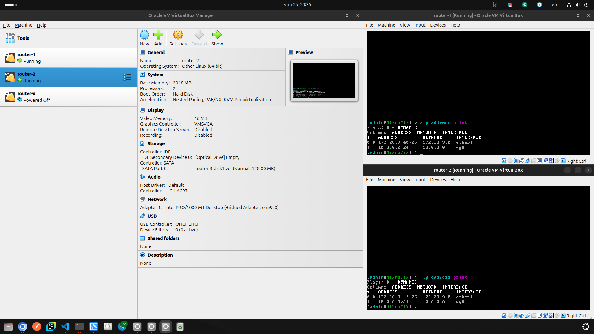
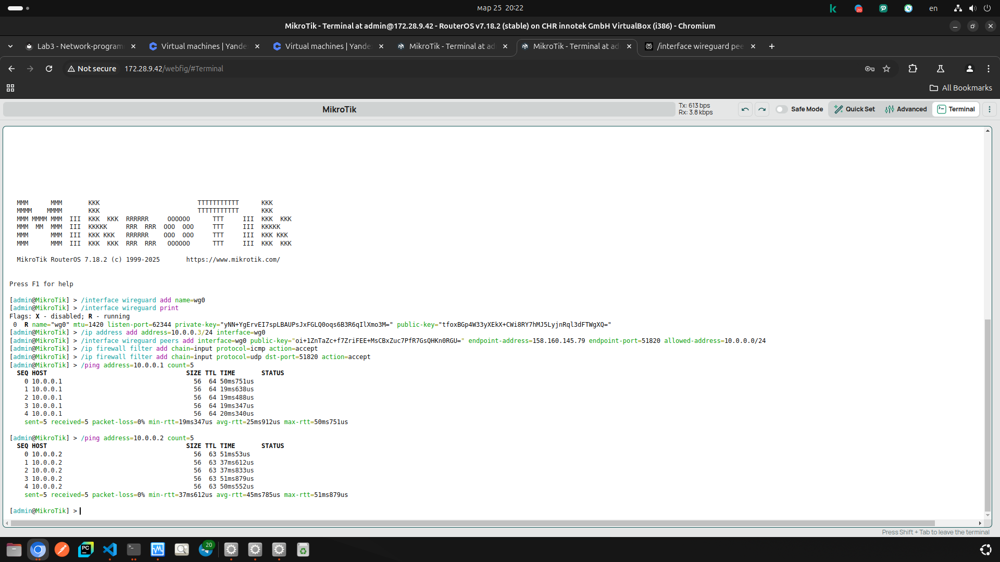
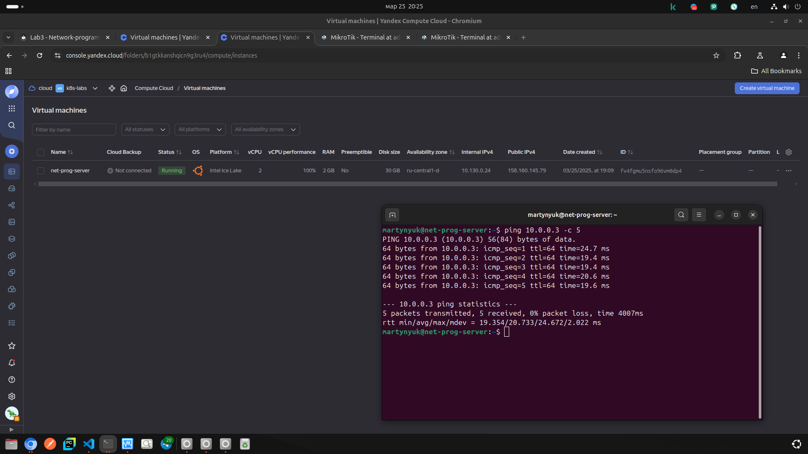

University: [ITMO University](https://itmo.ru/ru/)

Faculty: [FICT](https://fict.itmo.ru)

Course: [Network programming](https://github.com/itmo-ict-faculty/network-programming)

Year: 2024/2025

Group: K3320

Author: Мартынюк Алексей Петрович

Lab: Lab1

Date of create: 25.03.2025 

Date of finished: 25.03.2025

## Подготовка VM с RouterOS

Я использую домашний ноутбук с kubuntu. На нём уже был установлен VirtualBox.

С [официального сайта](https://mikrotik.com/download) скачиваем VDI image (раздел Cloud Hosted Router). 

Далее следуем [официальному гайду](https://help.mikrotik.com/docs/spaces/ROS/pages/262864931/CHR+installing+on+VirtualBox) по установке. 

Отдельный шаг - в настройках сети виртуальных машин необходимо выбрать адаптер типа bridge - так наши "роутеры" оказываются в одной сети с хостовой системой как самостоятельные устройства.

В итоге получаем VM с RouterOS (скрин делался в конце выполнения работы; при первом поключении путя 10.0.0.X/24 не будет - он добавляется в процессе настройки):



## Сервер

Я использую [Яндекс облако](https://yandex.cloud/ru). На созданной VPS выполнем: 

```
sudo apt update && sudo apt upgrade -y

sudo apt install wireguard -y

umask 077

wg genkey | sudo tee /etc/wireguard/private.key

sudo cat /etc/wireguard/private.key | wg pubkey | sudo tee /etc/wireguard/public.key
```

Заполняем файл ```/etc/wireguard/wg0.conf```:
```
[Interface]
PrivateKey = <server private key>
Address = 10.0.0.1/24
ListenPort = 51820
PostUp = iptables -A FORWARD -i wg0 -j ACCEPT; iptables -t nat -A POSTROUTING -o eth0 -j MASQUERADE
PostDown = iptables -D FORWARD -i wg0 -j ACCEPT; iptables -t nat -D POSTROUTING -o eth0 -j MASQUERADE

# router-1
[Peer]
PublicKey = <router-1 public key>
AllowedIPs = 10.0.0.2/32

# router-2
[Peer]
PublicKey = <router-2 public key>
AllowedIPs = 10.0.0.3/32
```

Затем:
```
sudo sysctl -w net.ipv4.ip_forward=1

sudo systemctl enable wg-quick@wg0

sudo systemctl start wg-quick@wg0

sudo ufw allow 51820/udp
```

## Роутеры

```
/interface wireguard add name=wg0  

/interface wireguard print

/ip address add address=10.0.0.X/24 interface=wg0 

/interface wireguard peers add interface=wg0 public-key="<server public key>" endpoint-address=<server real ip> endpoint-port=51820 allowed-address=10.0.0.0/24                                     

/ip firewall filter add chain=input protocol=icmp action=accept

/ip firewall filter add chain=input protocol=udp dst-port=51820 action=accept    

/ping address=10.0.0.1 count=5
```

## Итог

Проверяем связность устройст с помощью ping:

1. пинги роутера доходят до сервера
2. пинги роутера доходят до другого роутера


3. пинги сервера доходят до роутера


