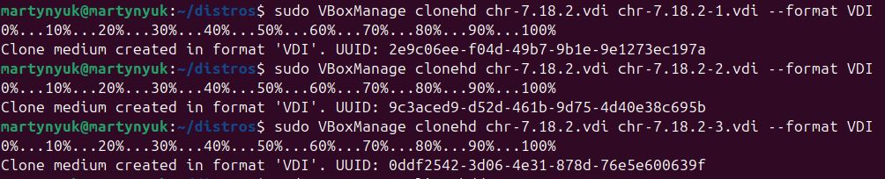
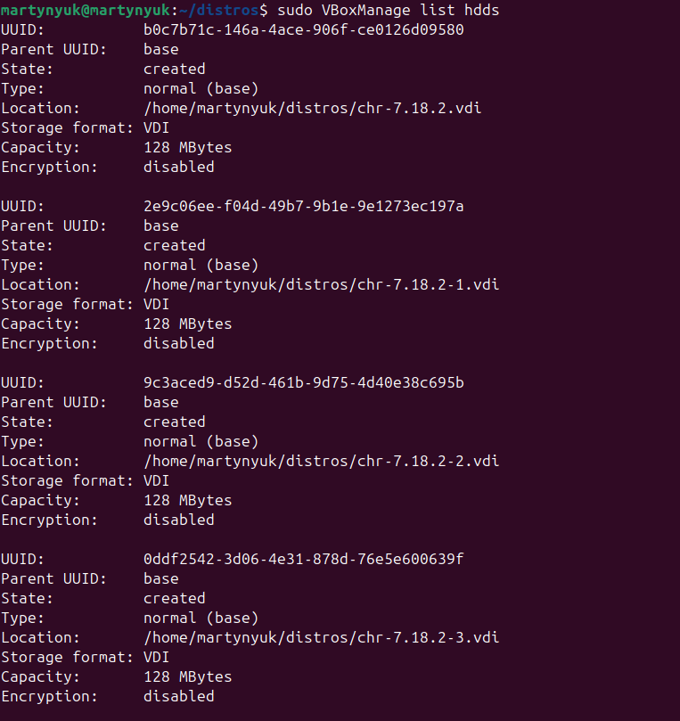
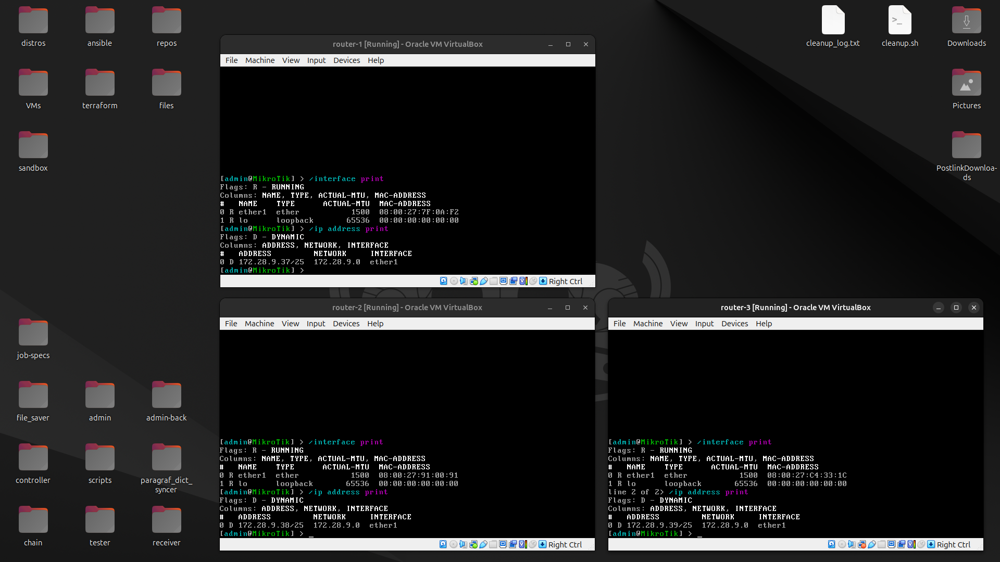
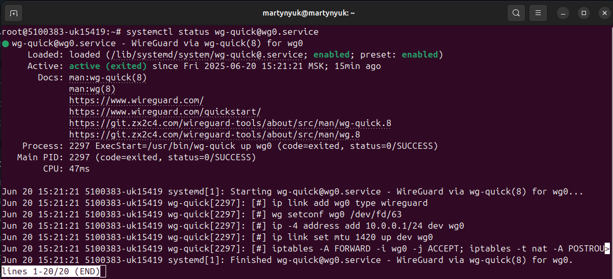
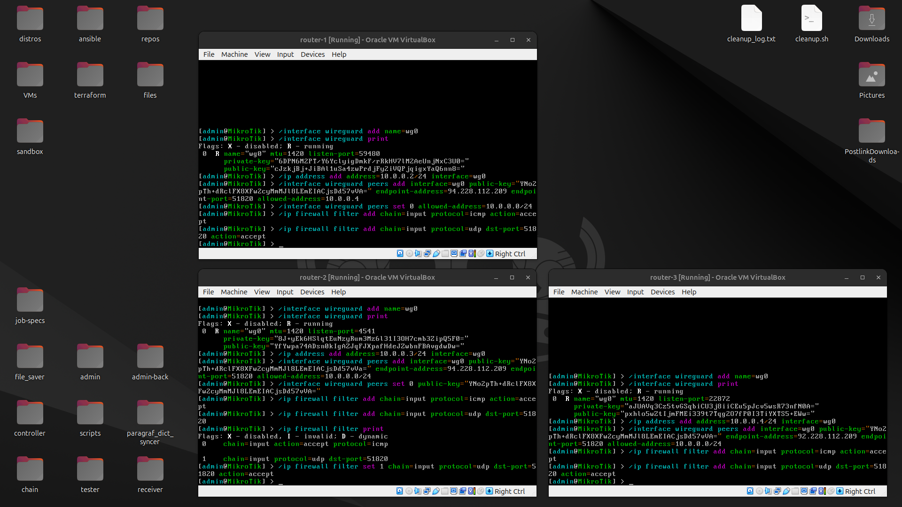
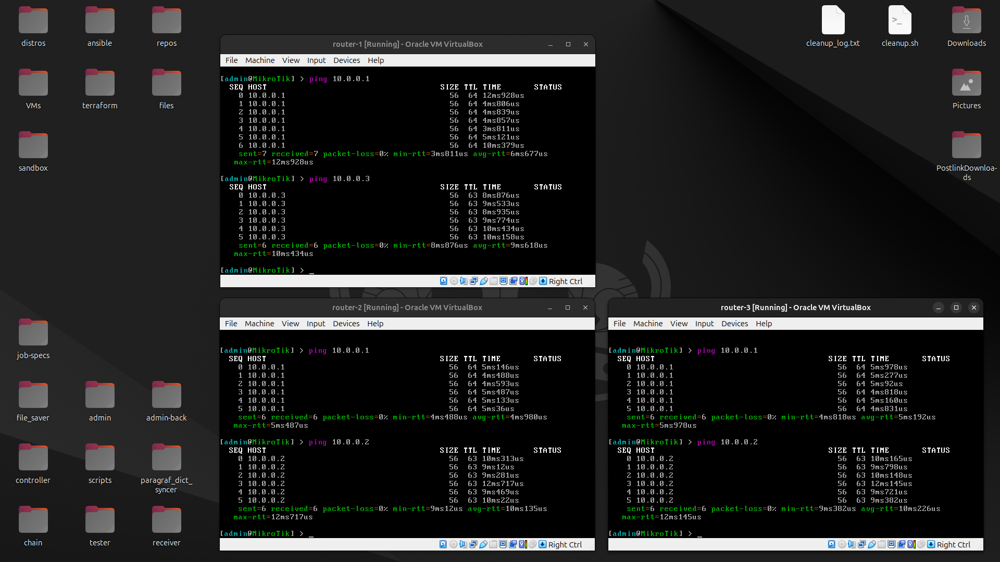
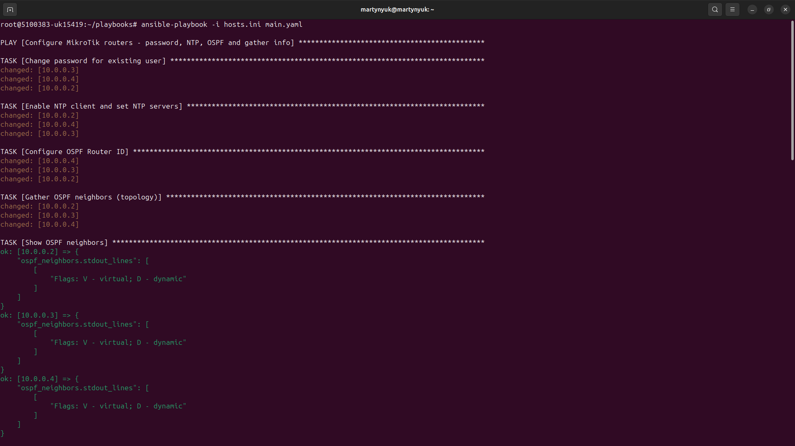
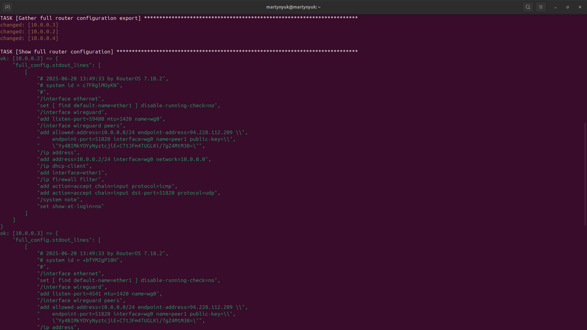
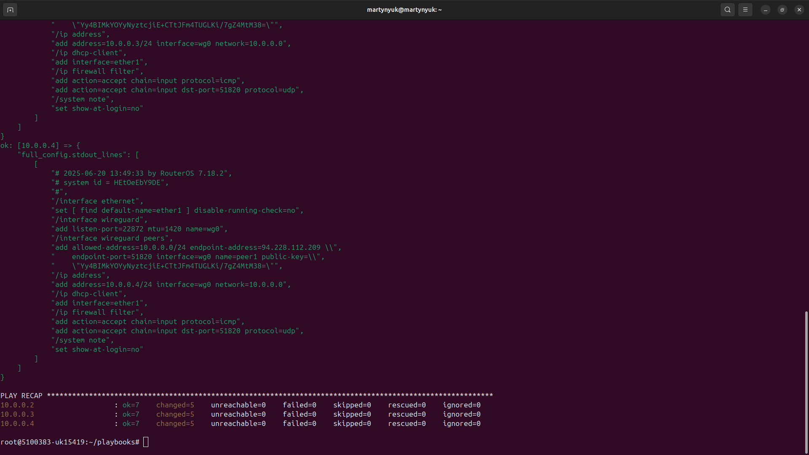

University: [ITMO University](https://itmo.ru/ru/)

Faculty: [FICT](https://fict.itmo.ru)

Course: [Network programming](https://github.com/itmo-ict-faculty/network-programming)

Year: 2024/2025

Group: K3320

Author: Martynyuk Alexey Petrovich

Lab: Lab2

Date of create: 20.06.2025 

Date of finished: 20.06.2025

## Описание проекта

Для выполнения этой работы я использую VPS в [TimeWeb](https://timeweb.com/) с ОС Debian 12 (Bookworm) и 3 свежих виртуальных машины (VirtualBox) с RouterOS.

Для создания нескольких ВМ клонирую VDI диски:







## Настройка сети

Повторяю действия первой лабораторной работы: устанавливаю Wireguard на сервере, заполняю конфиг публичными ключами микротиков, конфигурирую соответствующие интерфейсы на микротиках с публичным ключом сервера. 

Конфиг ```/etc/wireguard/wg0.conf```:
```
[Interface]
PrivateKey = <server private key>
Address = 10.0.0.1/24
ListenPort = 51820
PostUp = iptables -A FORWARD -i wg0 -j ACCEPT; iptables -t nat -A POSTROUTING -o eth0 -j MASQUERADE
PostDown = iptables -D FORWARD -i wg0 -j ACCEPT; iptables -t nat -D POSTROUTING -o eth0 -j MASQUERADE

# router-1
[Peer]
PublicKey = <router-1 public key>
AllowedIPs = 10.0.0.2/32

# router-2
[Peer]
PublicKey = <router-2 public key>
AllowedIPs = 10.0.0.3/32

# router-3
[Peer]
PublicKey = <router-3 public key>
AllowedIPs = 10.0.0.4/32

```

Запущенный VPN сервис на сервере:



Настройка VPN на роутерах:



Пинги между виртуалками и сервером в виртуальной сети:



## Установка Ansible на сервере

К сожалению, сделать православный ```apt install ansible``` не получится, так как в репозиториях Debian лежит версия времён Русско-Прусской войны, и роль community.routeros отказывается делать магию. 

Поэтому:

```
apt install python3.11-venv

python3 -m venv ~/ansible-venv

~/ansible-venv/bin/pip install ansible ansible-pylibssh

ln -s ~/ansible-venv/bin/ansible-playbook /usr/local/bin/ansible-playbook
ln -s ~/ansible-venv/bin/ansible /usr/local/bin/ansible
ln -s ~/ansible-venv/bin/ansible-galaxy /usr/local/bin/ansible-galaxy
```

Применяем плейбук (лежит в репозитории):





Конфиги приложены [здесь](./configs/)